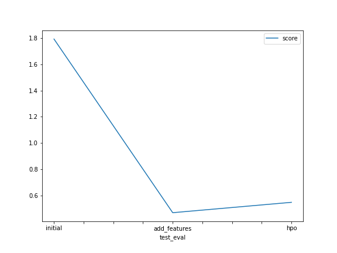

# Report: Predict Bike Sharing Demand with AutoGluon Solution
#### Ruthran Baskar

## Initial Training
### What did you realize when you tried to submit your predictions? What changes were needed to the output of the predictor to submit your results?
TODO: I followed all the steps given in the report so i dont any difficulties working on this rather than hyperparameter and some syntax. I had an issue with kaggle API I need to install some pip modules in order to connect to kaggle. 

### What was the top ranked model that performed?
TODO: WeightedEnsemble_L2 perfomed well in hyperparameter optimization

## Exploratory data analysis and feature creation
### What did the exploratory analysis find and how did you add additional features?
TODO: histogram shows how the datas are distributed accross the features. heatmap shows the how features are corelated to each other. and we can see that some of the features like holiday, season etc are of category thus we can change the data type to category. temp and atemp are highly corelated. 

### How much better did your model preform after adding additional features and why do you think that is?
TODO: by changing the some of the features to categoty and adding features like datetime into a single features like day,month, year and time gives a huge adavante to the model it increased the model performance.

## Hyper parameter tuning
### How much better did your model preform after trying different hyper parameters?
TODO: I tried with the hyperparameter given my the official website I didnt have enough time to explore further to work on tuning the hyper parameter. But I strongly assume by tuning the hyperparameter we can achieve the better model.

### If you were given more time with this dataset, where do you think you would spend more time?
TODO: If I get more time I'll work with the features like adding more features and applying one-hot encoding etc.

### Create a table with the models you ran, the hyperparameters modified, and the kaggle score.

model	hpo1	hpo2	hpo3-method	score
0	initial	time_limit = 600	presets='best_quality'	problem_type = 'regression'	1.79436
1	add_features	time_limit=600	presets='best_quality'	problem_type = 'regression'	0.46723
2	hpo	time_limit=600	presets='best'	regression	0.54647

### Create a line plot showing the top model score for the three (or more) training runs during the project.

TODO: Replace the image below with your own.

### Create a line plot showing the top kaggle score for the three (or more) prediction submissions during the project.

TODO: Replace the image below with your own.

## Summary
TODO: Add your explanation
After working with Autogluon to find the bike predicition count for the cities using the ML workflow gives alot of understanding and ideas how EDA helps in finding the features and modifying the features. 